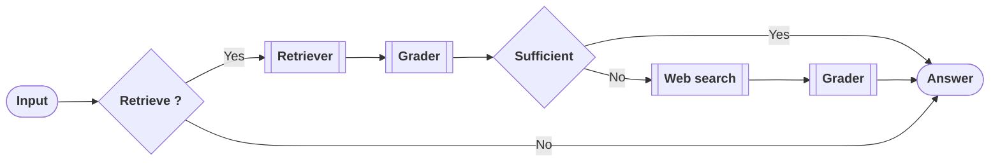

# Agent App – Conversational RAG API

A production-ready **FastAPI** service that exposes a **Conversational Retrieval-Augmented Generation (cRAG)** agent.

The system ingests PDFs into a **FAISS vector store**, retrieves relevant chunks using **OpenAI embeddings**, and uses a **graph-based agent** to produce context-aware, multi-turn answers.

---

# CRAG Architecture

## Mermaid

## Features

- **FastAPI HTTP API** with Swagger docs (`/docs`)
- **PDF ingestion** into FAISS vector store
- **Conversational RAG (cRAG)** with `thread_id`
- **Graph-based agent flow**
- **OpenAI LLM and embeddings**
- **CORS enabled** for frontend use

---

